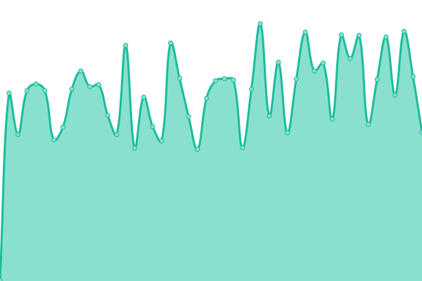

# [📈 Live Status](https://ardus-uk.github.io/upptime): <!--live status--> **🟧 Partial outage**

This repository contains the open-source uptime monitor and status page for [ardus-uk](ardus.co.uk), powered by [Upptime](https://github.com/upptime/upptime).

With [Upptime](https://upptime.js.org), you can get your own unlimited and free uptime monitor and status page, powered entirely by a GitHub repository. We use [Issues](https://github.com/ardus-uk/upptime/issues) as incident reports, [Actions](https://github.com/ardus-uk/upptime/actions) as uptime monitors, and [Pages](https://ardus-uk.github.io/upptime) for the status page.

<!--start: status pages-->
<!-- This summary is generated by Upptime (https://github.com/upptime/upptime) -->
<!-- Do not edit this manually, your changes will be overwritten -->
<!-- prettier-ignore -->
| URL | Status | History | Response Time | Uptime |
| --- | ------ | ------- | ------------- | ------ |
|  [ARDUS](https://www.ardus.co.uk) | 🟩 Up | [ardus.yml](https://github.com/ardus-uk/upptime/commits/HEAD/history/ardus.yml) | 

 647ms
     
 | 

<a href="https://ardus-uk.github.io/upptime/history/ardus">100.00%</a>
    

|  [PW Temple](https://www.pwtemple.co.uk) | 🟥 Down | [pw-temple.yml](https://github.com/ardus-uk/upptime/commits/HEAD/history/pw-temple.yml) | 

 0ms
     
 | 

<a href="https://ardus-uk.github.io/upptime/history/pw-temple">0.00%</a>
    

|  [Wigton Choral Society](https://www.wigtonchoral.org.uk) | 🟩 Up | [wigton-choral-society.yml](https://github.com/ardus-uk/upptime/commits/HEAD/history/wigton-choral-society.yml) | 

 357ms
     
 | 

<a href="https://ardus-uk.github.io/upptime/history/wigton-choral-society">100.00%</a>
    

|  [Cumbria Rural Choirs](https://www.cumbria-rural-choirs.org.uk) | 🟩 Up | [cumbria-rural-choirs.yml](https://github.com/ardus-uk/upptime/commits/HEAD/history/cumbria-rural-choirs.yml) | 

 321ms
     
 | 

<a href="https://ardus-uk.github.io/upptime/history/cumbria-rural-choirs">100.00%</a>
    

|  [Eigensolutions UK](https://www.eigensolutions.co.uk) | 🟩 Up | [eigensolutions-uk.yml](https://github.com/ardus-uk/upptime/commits/HEAD/history/eigensolutions-uk.yml) | 

 466ms
     
 | 

<a href="https://ardus-uk.github.io/upptime/history/eigensolutions-uk">88.71%</a>
    

|  [U3A Raspberry Pis](http://u3a.epizy.com/rpis) | 🟩 Up | [u3-a-raspberry-pis.yml](https://github.com/ardus-uk/upptime/commits/HEAD/history/u3-a-raspberry-pis.yml) | 

 546ms
     
 | 

<a href="https://ardus-uk.github.io/upptime/history/u3-a-raspberry-pis">88.97%</a>
    

<!--end: status pages-->

[**Visit our status website →**](https://ardus-uk.github.io/upptime)

## 📄 License

- Powered by: [Upptime](https://github.com/upptime/upptime)
- Code: [MIT](./LICENSE) © [ardus-uk](ardus.co.uk)
- Data in the `./history` directory: [Open Database License](https://opendatacommons.org/licenses/odbl/1-0/)
